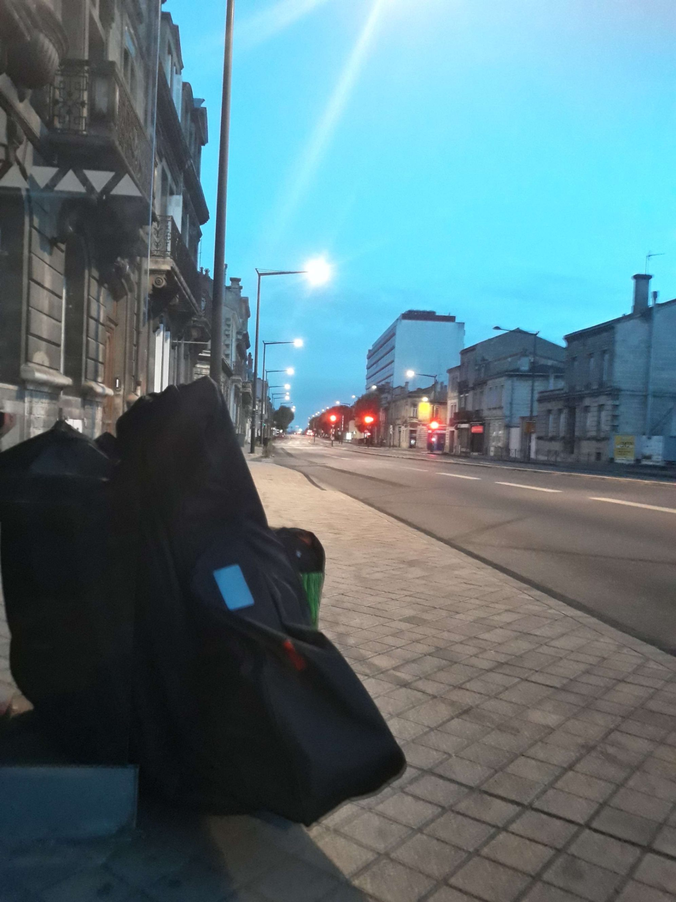
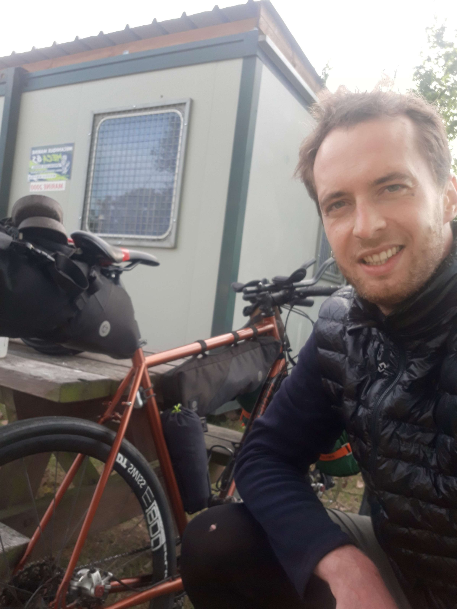

+++
title = "Preparation and Departure for Caen"
date = "2022-07-23 20:03:00.719336"
draft = "false"
+++

Departure (too) early this morning from Bordeaux, heading to Caen by train.

After many hours tossed around in a TGV then a TER, liberation at last. Reassembling the bike that was snugly wrapped in its bag, then departure for Ouistreham along the canal, ending with a long afternoon of sightseeing, including a nice exhibition in the town and numerous coffees.
<!--more-->






Departure of the ferry to Portsmouth scheduled for 11pm, arrival tomorrow, 7am...













## Comments

#### Yann
Awesome trip 😎
I've always dreamed of doing a road trip like this, but not possible... so it's great to live this journey vicariously through you 🤗
Thanks Ivan
Bon voyage
Bises

#### Fabienne
Hello Ivan
I'm a neighbour of Damien T. in Switzerland and I followed your NorthCape trip. Very impressed by your performance, especially the last two days. Bravo! I'll read your stories with pleasure
