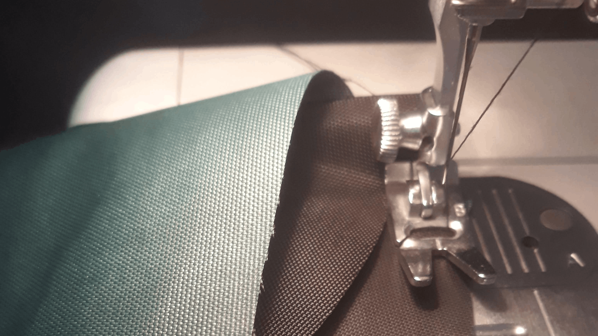

+++
title = 'Sew Your Own Backpack - Part 1'
date = 2026-03-18T20:48:22+01:00
draft = false
description = ""
categories = ["MYOG", "Sewing", "DIY", "Backpack", "hiking"]
cover = "index.jpg"
series = ["Sewing your hiking backpack"]
+++

For the second time, I'm tackling the making of a hiking backpack. This is a project that seems, to many, difficult, even insurmountable.
In reality, with a minimum of patience and equipment, it's a fairly manageable project.
Now, would I recommend it to a beginner sewer? No! But if you have some basic knowledge, as I do, why not embark on this little adventure?

# Why sew your own backpack

That's the first question that comes to mind: why?
There are indeed many brands on the market offering just as many models. For men, women, for 3 days, 6 days, 10 days, from 5 to 85 litres...
Let's not beat around the bush: if you want to find what you're looking for in stores, you can! There is an overwhelming selection, renewed virtually every season. And of course, my first backpacks were from big brands.

When you decide to make your own backpack, it's not to invent something fundamentally new, or even (much) better than what's available commercially. It's rather to create something **that perfectly reflects you**, both in terms of colours and materials, features, and even morphology.
Because, yes, a "homemade" backpack is necessarily custom-sewn. There's no question of making complex adjustment systems like those sold in stores: you measure your back length and adapt the pattern!
It's both more demanding, but also lighter and perfectly suited to your size.

Sewing your own backpack is also **not cheaper**, as we often tend to think. Or at least, it's not cheaper than a mid-range Decathlon backpack. However, it is cheaper than an [Atom Packs](https://atompacks.co.uk/) (which is my favourite brand), for relatively equivalent quality, if you are careful.

# The pattern

You can absolutely set out to create your own backpack pattern - there are even [dedicated tools](https://www.myogtutorials.com/tools/). However, especially if it's your first one, I recommend the modest investment of buying a pattern.
Personally, I'm won over by those from [Prickly Gorse](https://www.myogtutorials.com/), an English hiking enthusiast who offers his creations, tested and approved in the field (by me, among others).

> Note that some of his simpler patterns are available for free, if you want to get some practice before tackling a bigger project.

In this series, I'll share the making of the [40-litre framed ultralight backpack](https://www.myogtutorials.com/40-litre-framed-ultralight-backpack/) with a back plate. I made the 60-litre model two years ago, which I find fantastic but just a little too big and flashy, as I sewed it with scraps of all colours.

# The fabric

For the fabric, it's the same story. Technically, you can probably turn to a regular supplier, such as Mondial Tissu for example. However, you will only find very basic fabrics there, not necessarily durable or waterproof. So I recommend turning to specialised websites - and there are few of them - such as [extremtextil](https://www.extremtextil.de/en). In my opinion, it's the only truly worthwhile European retailer for this kind of material. They are inexpensive, and it's a true Ali Baba's cave where you can easily lose entire afternoons.

Unfortunately, it will cost you between €10 and €20 in shipping from Germany to receive your precious parcel... And that's a week later! So make sure to order enough fabric and accessories, maybe even a little extra.

> When I talk about accessories, I mean all those small plastic "things" that adorn backpacks: buckles, loops, hooks of all kinds. Not to mention webbing and other zippers.

Prickly Gorse gives plenty of advice on materials to use for each part of the backpack. Generally speaking, remember that [X-pac](https://www.x-pac.com/) and [Ecopak](https://www.challenge-outdoor.com/ecopak) are two excellent choices. These materials are quite rigid, waterproof and very abrasion-resistant, while remaining incredibly lightweight. Characteristics that naturally make them ideal choices for a hiking backpack.

# The sewing machine

It would be unthinkable to talk about sewing without mentioning the sewing machine! Here, good news, you can sew your backpack with almost any machine, as long as it's not a toy from Action.
I've used both an old machine from the eighties and a modern digital machine, and in both cases the result was up to par. What you need to pay most attention to is the maximum thickness your machine can handle, because when sewing the shoulder straps, it can quickly become significant!

If you've read this far, you're seriously interested in creating this backpack! Now that everything necessary is gathered, it's time to move on to [the making]().
