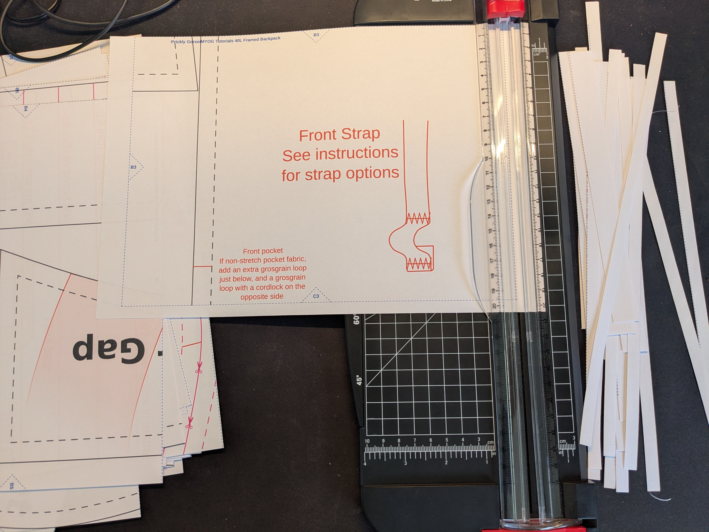
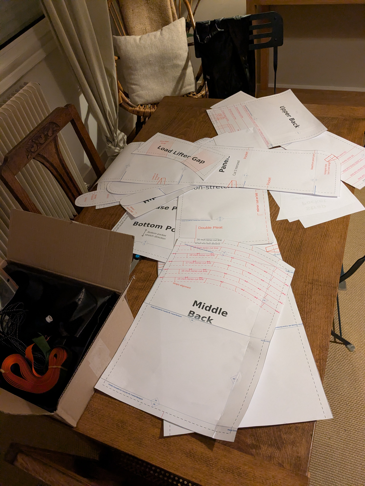
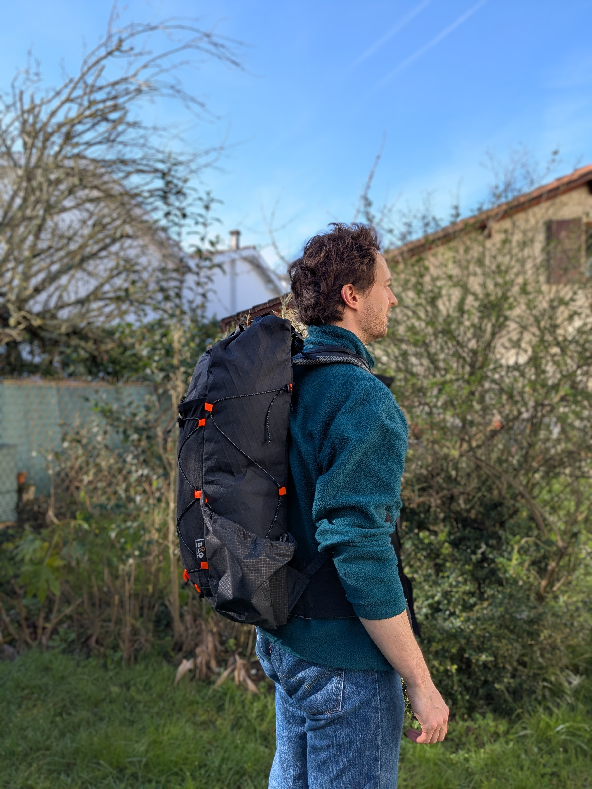

+++
title = 'Coudre son propre sac - Partie 2'
date = 2026-03-20T20:48:22+01:00
draft = false
description = ""
categories = ["MYOG", "Couture", "DIY", "Sac à dos", "rando"]
cover = "index.jpg"
series = ["Coudre son sac de rando"]
+++

Une fois que les matériaux sont réunis et que le patron est acheté, il n'y a "plus qu'à"... coudre ? 
En fait non. Je me suis rendu compte au fil des projets qu'une phase de préparation assez longue est systématiquement nécessaire avant le démarrage à proprement parler... 

<!--more-->

# Patron et découpe
Si vous avez acheté un patron en version dématérialisée, comme c'est mon cas, vous allez devoir passer par l'étape de l'impression. Ils sont généralement fournis _a minima_ au format A4, donc vous pouvez les imprimer sur une imprimante domestique, pour ensuite venir assembler les feuilles, puis découper les différents éléments.

Alors que vous pensiez en avoir fini avec le maniement des ciseaux, voilà que vient le tour de la découpe du tissu en lui-même. Il convient, bien évidemment, de tracer ces formes de papier sur le tissu technique, ce qui n'est parfois pas chose aisée, avant de pouvoir le découper avec des ciseaux nécessairement affûtés. Ne soyez pas étonnés, on attrape facilement des ampoules aux doigts à force.

> Pour décalquer le patron, je vous conseille des crayons-craie que l'on trouve aisément dans les magasins de couture. Pour les tissus ou matériaux vraiment particuliers comme la mousse EVA des bretelles ou le tissu stretch, on peut utiliser du Posca ou du Tipp-Ex. Attention cependant à faire vos tracés sur l'envers si le tissu doit être visible, car c'est presque impossible à détacher !

Ces deux étapes longues et fastidieuses terminées, vous pouvez enfin passer à la partie amusante de votre projet : la couture.

# Coudre du tissu technique

Il vous faut deux choses pour bien réussir vos coutures sur votre cher tissu (dans tous les sens du terme) :

* du fil épais de qualité
* des aiguilles neuves adaptées à votre fil

Vous pourrez avoir la meilleure machine du monde, si ces éléments ne sont pas réunis, vos coutures ne seront pas propres et le sac ne sera pas durable. 
Je vous conseille le [Alterfil S50](https://www.extremtextil.de/en/alterfil-s-50-sewing-thread-polyester-500m/70010.NATUR), un fil polyester (c'est primordial) extrêmement résistant. Notez qu'il s'utilise avec des aiguilles particulièrement larges (puisqu'il est épais, c'est logique). Il faut donc qu'elles soient neuves et bien aiguisées, sinon vous allez abîmer le tissu, et votre machine pourrait même avoir du mal à passer sur les grosses épaisseurs.

> Pourquoi du fil polyester impérativement ? Le fil en coton est adapté aux toiles en coton uniquement, car il a la particularité de se gorger d'eau et de gonfler. Dans le cas d'une tente en coton, c'est idéal, car cela participe à l'étanchéité de l'ensemble, puisque le fil vient boucher fermement les trous laissés par l'aiguille. Pour une toile en nylon, cela n'a aucun intérêt car elle ne se déforme pas, ou peu, au contact de l'eau. On préférera donc utiliser un fil polyester et éventuellement réaliser une imperméabilisation des coutures a posteriori avec un produit adéquat.






Il faut prévoir un stock industriel de petites pinces en plastique pour réaliser les ajustements et éviter que tout ne bouge pendant la couture. Il vaut mieux éviter les aiguilles, car elles laisseraient des trous visibles. 

La partie dorsale du sac constitue sans aucun doute la plus grosse difficulté de cette réalisation. Il y a beaucoup d'épaisseurs à coudre : le tissu, la mousse EVA, le mesh ; et la légère courbe sur la couture des bretelles nécessaire au confort de portage peut être assez subtile à bien réaliser.

Comme on peut le voir sur cette photo, j'utilise parfois un ruban adhésif spécial couture, pour fixer deux morceaux de tissus entre eux. Ça peut être pratique pour de petits ourlets, ou pour positionner une petite pièce à un repère précis sur un élément plus grand. 
Pour cette couture un peu difficile je n'ai qu'un conseil : si elle n'est pas parfaite, décousez et recommencez. Les vingt minutes perdues seront largement compensées si vous êtes totalement satisfait de votre réalisation. De plus, le confort du sac en dépend !

# Armature

Ce sac possède une armature, ce qui me semble nécessaire pour des charges de plus de dix kilos. En dessous, on pourra imaginer s'en passer (et encore), mais pour mon confort, je trouve que c'est indispensable. Son fonctionnement est très simple : il s'agit d'une plaque de polypropylène, sur laquelle sont scotchés deux tubes en aluminium. Rien qui ne se trouve dans un bon magasin de bricolage, en somme.
Ce montage présente l'avantage d'être simple, peu cher, plutôt léger et très résistant. Il est fixé dans le sac grâce à une grande poche interne qui l'empêche de bouger. 






Jusqu'à présent je n'ai jamais eu de problème avec ce système sur mon autre sac, à l'exception du fait qu'il grince pas mal lorsqu'il est chargé... Mais on peut arguer que c'est de ma faute.

# Place aux essais

C'est bête à dire, mais il est essentiel **d'essayer** votre sac une fois qu'il est terminé ! Si des ajustements sont à faire, faites-les, quitte à découdre. C'est pénible, mais mieux vaut passer un peu de temps de plus maintenant que d'avoir mal au dos pendant un trek de 10 jours.
Sur le patron que j'utilise, on dispose tout de même de quelques réglages bienvenus au niveau des sangles, qui permettent de changer un peu les points d'appui histoire de soulager des épaules ou des hanches fatiguées.

# Petit tour des fonctionnalités

J'ai fait quelques ajustements par rapport à la première version du sac, grâce à mon retour d'expérience sur plusieurs centaines de kilomètres :

* une poche de bretelle plus grande pour y loger des lunettes ou un en-cas
* une véritable fixation pour mon tube d'hydratation qui avait tendance à se balader un peu n'importe où
* de grandes poches sur la ceinture ventrale pour ranger notamment mon téléphone
* des élastiques de fixation sous le sac, plutôt que des sangles qui se détendaient régulièrement
* le super logo de ma vraie-fausse marque, BAG (Béthus Adventure Gear), parce qu'il faut savoir s'amuser, tout de même








Et maintenant, plus qu'à l'essayer ! A priori, son premier voyage sera dans les Cévennes, sur le Chemin de Stevenson.
Si vous avez des questions ou des envies de réalisations similaires, n'hésitez pas à vous manifester en commentaire. 