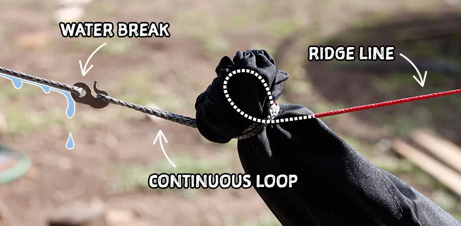
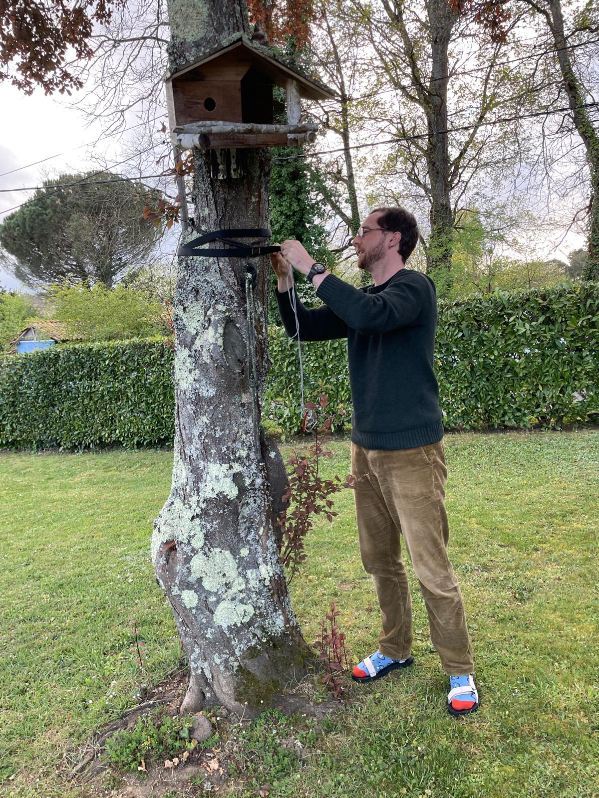
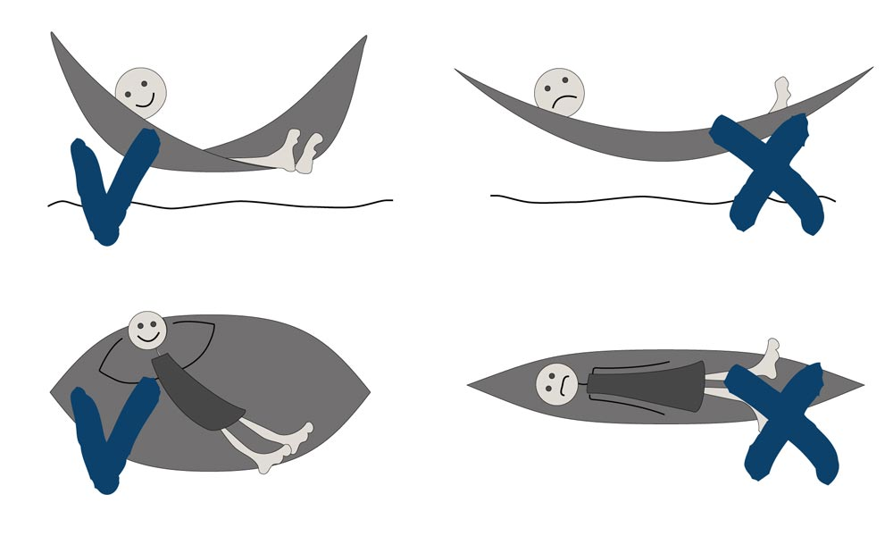
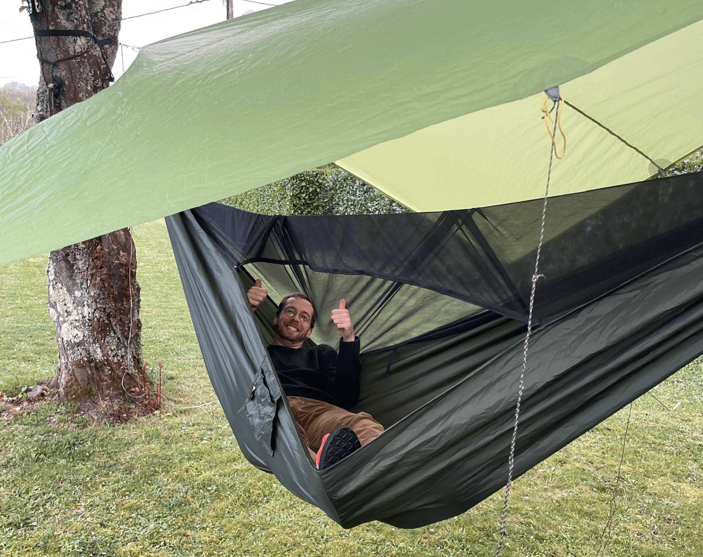
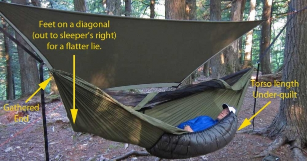

+++
title = 'Une nuit en hamac'
date = 2026-04-06T10:06:36+02:00
draft = true
description = ""
categories = ["bivouac", "matériel", "hamac"]
series = []
cover = "index.jpg"
+++

Depuis ma randonnée sur le GR-R2, j'avais une envie : essayer un hamac. Mon ami Camille en avait amené un lors de nos excursions et je dois bien avouer qu'il m'a fait envie, notamment pour deux raisons.
Premièrement, être isolé du sol; ça paraît peut-être un détail, mais lorsque le sol est humide, poussiéreux, sablonneux... je trouve qu'il est vite assez désagréable de s'y installer, sans même parler de l'effet délétère sur les fermetures éclair. 

<!--more-->

Deuxièmement, lorsque vient l'heure, entre chiens et loups, de se détendre au bivouac après une longue journée de marche, je dois bien admettre que je ne suis pas souvent à mon aise. Je suis grand, peu souple, et donc rarement bien installé, assis par terre ou sur une racine vaguement plate. Alors voir mon ami confortablement installé dans son hamac avec son petit bouquin, ça m'a rendu jaloux plus d'une fois. 

Ni une ni deux, en rentrant de ce voyage, j'ai commandé sur le site [military.eu](https://military.eu/fr/) un hamac relativement léger et surtout très grand, le modèle [Ważka V1 "long"](https://military.eu/fr/p/tigerwood/hamac-avec-moustiquaire-wazka-v1-long-tigerwood-green-69714) de la marque polonaise TigerWood.

> Que l'on se rassure, je n'ai aucune fascination morbide pour les armées, mais ce site propose une incroyable sélection de matériel de randonnée peu cher. La qualité est parfois en deçà des attentes, mais pour tester des petites choses, c'est idéal, et on a parfois de bonnes surprises.

# Fixation

Il existe de nombreuses techniques pour fixer un hamac, des cordes et noeuds divers et variés. En bon néophyte que je suis, j'ai opté pour un [système prêt à l'emploi](https://military.eu/fr/p/tigerwood/suspension-pour-hamac-spider-tigerwood-51693) de la même marque, utilisant des sangles plates pour ne pas abîmer l'écorce des arbres. C'est simple, rapide et très facile à ajuster grâce au système de [whoopie sling (🇬🇧)](https://en.wikipedia.org/wiki/Whoopie_sling) qui permet de régler la longueur de corde.

Il existe naturellement d'autres méthodes pour attacher un hamac, le seul point d'attention étant de bien prévoir un système anti-écoulement pour l'eau de pluie :

Concernant la hauteur de fixation des sangles, un bon repère est la hauteur des yeux. Ce conseil est évidemment à adapter si l'on n'est pas très grand et que le hamac touche le sol.

# Position

L'une des méconnaissances les plus tenaces est peut-être que l'on doit dormir en long dans un hamac, dans la fameuse position "banane". Rien n'est pourtant moins vrai ! Si c'est pour lire ou faire une petite sieste de vingt minutes, pourquoi pas. Mais si vous comptez passer la nuit, votre dos vous fera rapidement comprendre que ça ne va pas se passer comme ça.
En réalité, pour bien dormir dans un hamac, il faut se positionner _en travers_ de la toile. Eh oui, c'est cette position qui vous permettra d'être le plus à plat possible. Si votre couchage est bien fait, vous devriez pouvoir dormir sur le dos ou le côté sans trop de problème, par contre, il faut oublier vouloir dormir sur le ventre.

# Température

C'est là où le bât blesse : un hamac nécessite un équipement particulier pour dormir confortablement, j'ai nommé l'underquilt. L'idée est simple, plutôt que de dormir dans un duvet dont on va compresser l'isolant entre son corps et la toile, le rendant inefficace, on utilise un "demi-duvet" qui va venir se placer sous le hamac et ainsi conserver ses propriétés. 

Si l'on veut pousser la logique plus loin et dans un souci d'économie de poids, on utilisera également un quilt, c'est-à-dire une moitié supérieure de duvet pour se couvrir. Ce sont donc potentiellement deux accessoires supplémentaires à acquérir. J'ai effectué mon petit test avec mon excellent duvet [Cumulus LITE LINE 300](https://cumulus.equipment/fr/eu/c/sacs-de-couchage-en-duvet) avec une température confort de 4°, ce qui était prévu cette nuit-là et... J'ai eu froid. Pas un froid insupportable, j'ai réussi à dormir, mais ce n'était certainement pas confortable.

Soyons honnêtes, l'underquilt est indispensable dans un usage trois saisons, c'est donc à prendre en compte si vous souhaitez passer complètement au hamac lors de votre prochain voyage. 
